# Windows 9x QuickInstall

### (C) 2012 - 2026 E.Voirin (oerg866) <!-- omit from toc -->
### **Windows is a trademark of Microsoft Corporation.** <!-- omit from toc -->
### **This project has NO ENDORSEMENT WHATSOEVER from Microsoft Corporation.** <!-- omit from toc -->

Please don't sue. I just like old computers!! :(

## Table of Contents <!-- omit from toc -->
- [Windows 9x QuickInstall](#windows-9x-quickinstall)
  - [Screenshots](#screenshots)
  - [What is QuickInstall?](#what-is-quickinstall)
  - [How "Quick" is QuickInstall *really*?](#how-quick-is-quickinstall-really)
- [The QuickInstall Framework](#the-quickinstall-framework)
  - [Creating QuickInstall Images](#creating-quickinstall-images)
  - [Fixes, Patches and Drivers provided by the QuickInstall Environment](#fixes-patches-and-drivers-provided-by-the-quickinstall-environment)
  - [Pre-Built Reference Images (aka. I don't want to read and/or do all of this.)](#pre-built-reference-images-aka-i-dont-want-to-read-andor-do-all-of-this)
- [Booting / Starting QuickInstall](#booting--starting-quickinstall)
  - [QuickInstall System Requirements for Installation](#quickinstall-system-requirements-for-installation)
  - [Native Floppy Disk Boot (`floppy.img`)](#native-floppy-disk-boot-floppyimg)
  - [CD / DVD-ROM Boot](#cd--dvd-rom-boot)
  - [DOS-Based Booting of QuickInstall](#dos-based-booting-of-quickinstall)
  - [USB Flash Drives, SD/CF cards, also on UEFI systems](#usb-flash-drives-sdcf-cards-also-on-uefi-systems)
- [The QuickInstall Installer](#the-quickinstall-installer)
  - [Main Menu](#main-menu)
  - [Hard Disk Partitioning Tool](#hard-disk-partitioning-tool)
  - [Installation](#installation)
- [The Emergency Linux Shell](#the-emergency-linux-shell)
  - [3dfx Voodoo 2 Diagnostics (`witchery`)](#3dfx-voodoo-2-diagnostics-witchery)
- [Frequently Asked Questions](#frequently-asked-questions)
  - [Framework Building Guide, Bugs, License, etc.](#framework-building-guide-bugs-license-etc)
  - [Special Thanks](#special-thanks)


## Do you want... <!-- omit from toc -->
* ...to install Windows 98 or ME *extremely quickly*?
* ...to test a lot of acquired retro-hardware in quick succession?
* ...to install Windows 9x from a USB flash drive or perhaps an SD card?
* ...to install Windows 9x to and boot from an ***NVMe SSD***?
* ...***native AHCI and USB 2.0*** support on Windows 9x?
* ...a fully patched Windows 9x version without manually installing *everything*?
* ...a Windows 9x version that works on modern computers, including non-CSM UEFI machines?
* ...a Windows 9x version optimized for small footprint, maximum functionality and comfort?
* ...said version to also excel on 486-class machines?
* ...a Windows 9x installation with lots of integrated drivers and a lot more available on the install disk?

If you answered *"yes"* to any of the above, you may want to keep reading...

## Screenshots

| | | |
|--------------------------|--------------------------|--------------------------|
|  |  |  |
|  |  |  |
|  |  |                          |

## What is QuickInstall?

Windows 9x QuickInstall is a framework intended to replace the original Windows 9x setup environment and provide an extremely quick and highly optimized and customized installation process paired with integrated patches and drivers. In that sense, it is not dissimilar to *nlite*, but the method used to achieve this is very different.

QuickInstall images are derived from *already set-up and working installations*. This means that they retain any patches, drivers and software that is already installed, enabling more powerful, comfortable, modern and headache-free Windows 9x installations than ever before.

Combining this method with the blooming landscape of third-party patches and fixes, it opens up these classic operating systems to a vast variety of machine classes, ranging from early 486 systems to the very latest Core Ultra and Ryzen machines available on the market today (yes, really).

After preparation, the image is stripped of hardware detection information, and upon installation the Windows 98 Setup's hardware detection phase is re-run, accessing the vast driver library available with QuickInstall.

QuickInstall uses a Linux-based custom installation environment that quickly writes the full installation image to a target directory of your choosing, using a specially-crafted flat binary file format (*MercyPak*) that is designed to be read exactly once, in sequence, to avoid expensive CD drive seeking and attain the maximum installation speed possible.

**This also means you can finally install Windows 9x from USB without any fuss!**  
...or from a CD/DVD-R. Or boot from a floppy disk and *then* install off of USB.

The truth is, it does not matter how you boot the system or where the QuickInstall data is located, if you manage to boot the kernel, the installation environment will find its files. This also means that you can install Windows from USB on machines that do not support USB-Boot (using the boot floppy)!

And yes, this does mean that the effort for a user to build an ISO is higher than for example nLite, but the degree of customizability is also massively increased.

A set of reference images is also provided for your convenience and to get a feel for the vast power that QuickInstall provides to the retro enthusiast of ~~2023~~ ~~2024~~ ~~2025~~ 2026. Enabling ***you*** to install your favorite flavor of vintage Windows *faster than ever*.

## How "Quick" is QuickInstall *really*?

It depends where!

- In VirtualBox on a modern machine? **15 seconds.**
- On a Pentium III 866MHz with a DVD-ROM and an ATA133 disk? **60 seconds.**
- On a 486 DX4-100? **5 minutes.**

In *any* case, QuickInstall is at least an ***order of magnitude (i.e. 10x)*** faster than the official Windows 98 `setup.exe`

# The QuickInstall Framework

The QuickInstall Framework provides a set of scripts and tools to create bootable ISO / USB images that can install Windows 9x operating systems quickly using the integrated installation environment.

### Supported Target Operating Systems <!-- omit from toc -->

* Microsoft Windows **98** (Build 4.10.1998) -- *UNTESTED* 
* Microsoft Windows **98 Second Edition** (Build 4.10.2222)
* Microsoft Windows **Millenium Edition** (Build 4.90.3000)

Support for international versions is not properly tested. It should work and in my testing it does, but YMMV.

**NO versions of Windows 95 are or likely will ever be supported due to non-PNP device detection being part of the DOS-based installer stage.**

## Creating QuickInstall Images

Creating custom QuickInstall installation images using the framework scripts is a complex process.

Refer to the guide:

### [QuickInstall Image Creation Guide](./IMAGE_CREATION.md) <!-- omit from toc -->

## Fixes, Patches and Drivers provided by the QuickInstall Environment

These patches and fixes do not need to be integrated into the Windows image before creating a QuickInstall image.

* **CREGFIX**  
  This is a patch for CREGFIX an issue of many modern CSM BIOS implementations where certain control register bits are left dirty, causing issues when trying to run Windows 9x ("*While initializing device VCACHE: Windows protection error*") or while trying to run EMM386.EXE.

  **This universal VxD fix version was provided by [**SweetLow / LordOfMice**](http://github.com/LordOfMice)**

* **Silent Default Display Prompt**  
  This gets rid of the "Default Monitor" install dialog that normally pops up.

* **UEFI boot files (CSMWRAP)**  
  This is a EFI binary that provides BIOS emulation functions on EFI-only systems without CSM, allowing you to boot Windows 9x on them.

  Courtesy of: https://github.com/FlyGoat/CSMWrap

* **LBA64HLP and GPT Disk drivers**  
  This is an experimental set of drivers for Windows 9x to enable support for LBA64 disks, especially those with the GPT partition layout.
  It also supports 4kn sector disks. In theory, together with Paragon NTFS for Windows 98 you can gain write access to modern Windows drives, so be careful!

  By [**SweetLow / LordOfMice**](http://github.com/LordOfMice)

And not to forget, the ***vast driver libraries***:

* `win98-driver-lib-base`

  These drivers will be processed and packaged alongside the OS data. If selected during installation, these drivers are integrated into Windows and will be found during any hardware detection.

  This includes many network drivers, common sound and video card drivers, storage drivers, etc.

  This includes the excellent USB 2.0, USB Mass Storage and NVMe driver stacks from [**SweetLow / LordOfMice**](http://github.com/LordOfMice).
  It also includes his patched versions of the R.Loew native AHCI SATA drivers.

* `win98-driver-lib-extra`

  These drivers will be processed and packaged in a subdirectory of the installation media, but they are not injected into Windows' automatic hardware detection. This can have several reasons:
  - The driver is very big
  - The driver is part of a hardware family where no single driver is guaranteed to be optimal
  - The driver is for a chip, but may lack card vendor-specific functionality
  - The driver is known to cause problems

## Pre-Built Reference Images (aka. I don't want to read and/or do all of this.)

The reference images come in three flavors:

- Windows 98 SE: **Stock installation**
- Windows 98 SE: **98Lite Micro De-Bloated installation with DirectX 8.1**
- Windows ME: **98Lite Micro De-Bloated installation with DirectX 8.1**

All of these images are pre-patched for usage with both the very latest and very old hardware alike without running into the usual problems with memory size, CPU issues (TLB invalidation bug, CSM control register bug) or hard disk sizing problems (LBA48 issues, etc.).

These images also contain a lot of drivers and useful utilities for benchmarking, overclocking, diagnostics, et cetera.

The list of patches can be found in the Documentation linked below:

### [QuickInstall Pre-Built Reference Images](https://github.com/oerg866/win98-quickinstall/releases/latest) <!-- omit from toc -->

### [QuickInstall Pre-Built Reference Image Documentation](REFERENCE.md) <!-- omit from toc -->

# Booting / Starting QuickInstall

## QuickInstall System Requirements for Installation
  - i486-class CPU, at least a 486SX (but it will be very slow)
  - 24 MiB of memory
  - An IDE / SATA / SCSI / NVMe controller supported by Linux

There are several provided methods to boot into Windows 9x QuickInstall:

## Native Floppy Disk Boot (`floppy.img`)

  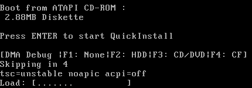

  This is a 1.44M floppy disk image that contains a full kernel with USB support.  
  It will find its installation source media automatically, meaning you can use it together with a QuickInstall CD/DVD-ROM, USB flash drive (even if your system does not support booting from either of them), CF-Card or Hard Disk.

  **Note:** Due to the strong compression used in this version, the system will take a long time to start up on 486SX/DX-class machines. I recommend using `dosflop.img` instead.

  **Note:** Due to the size constraints, this version does not print diagnostic messages on the screen when starting up.

## CD / DVD-ROM Boot

  

  The `iso` images can be written to a CD or DVD and then booted. **This is the recommended method on systems that support this.**
  
  Since this uses the classic *floppy emulation* boot method it should work very well even on the earliest BIOSes that provide CD-ROM boot support.

## DOS-Based Booting of QuickInstall

The Linux Kernel on the QuickInstall media can be loaded from DOS. To facilitate this, a batch file named `INSTALL.BAT` is provided in the root directory.

Navigate to the CD-ROM or Hard Disk drive that contains the Windows 9x QuickInstall files and type `INSTALL` to start QuickInstall.

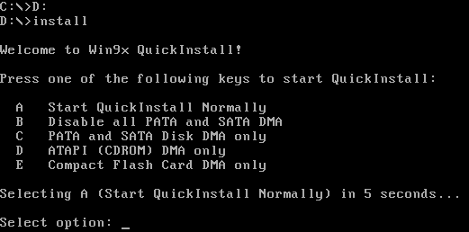

### FreeDOS Floppy + CD-ROM Boot (`dosflop.img`) <!-- omit from toc -->

This is a 1.44M floppy disk image with FreeDOS and a CD-ROM driver that loads and boots QuickInstall directly off of a CD-ROM or hard disk drive (using `LOADLIN`).

**Recommended** if you have a computer that does not support CD-ROM boot or if you have the QuickInstall files on an ATA/ATAPI media or other device that is exposed using Int 13h that you cannot boot from.

**Note:** If you have a SCSI CD-ROM drive, the image must be modified accordingly.

## USB Flash Drives, SD/CF cards, also on UEFI systems

By using an appropriate tool, you can write the `usb` images to a flash drive and boot off of it.

You can also use the *Native Floppy Disk Boot* method to execute QuickInstall off a flash drive if your PC does not support booting from such media.

An example sequence could look like this:

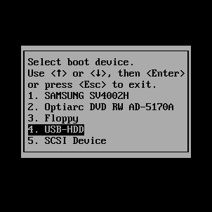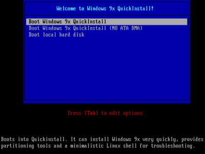


### Writing the bootable USB image to a USB flash drive, SD or CF card <!-- omit from toc -->

- On Linux, you can use `dd`
  - `sudo dd if=<USB image file> of=/dev/sdX bs=1M status=progress`
    
    Replace `/dev/sdX` with the USB flash drive's device path.  
    Example:

    ```
    $ sudo dd if=win98qi_v0.9.6_ALL_usb.img of=/dev/sdc bs=1M status=progress
    1248+1 records in
    1248+1 records out
    1309323264 bytes (1,3 GB, 1,2 GiB) copied, 1,26113 s, 1,0 GB/s
    ```


- On Windows, you can use the [Windows port](http://www.chrysocome.net/dd) of `dd` or [Win32 DiskImager](https://sourceforge.net/projects/win32diskimager), for example:
  
  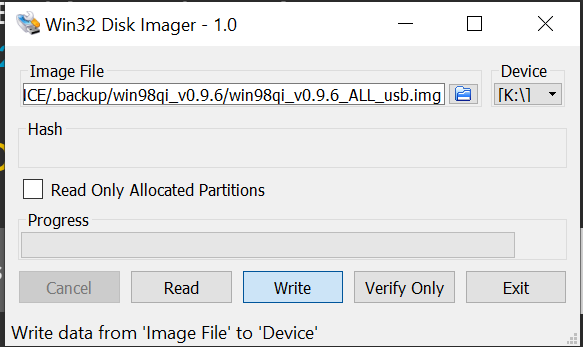

### UEFI Boot (Caution: experimental!) <!-- omit from toc -->

  Executing the steps described above, the resulting media can also be booted on UEFI systems, even those that lack the Compatibility Support Module (CSM).

  **Note:** UEFI installation support is *very* experimental at this point in time, and no support can be provided if it fails.

### Hard Disk / CF-Card / SD-Card Boot <!-- omit from toc -->

  It is not recommended, but you can also write the "usb" image to a hard disk drive.  
  As long as your system supports booting from it, it will work and install normally.

---

# The QuickInstall Installer

Dubbed `lunmercy` internally (long story...), this is a custom installer written in C that guides the user through the entire installation process.

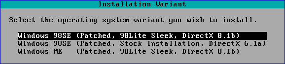

After you launch QuickInstall and made it past the introductory text, either you are sent to the [main menu](#main-menu), or you will be asked which operating system version you wish to install - if the booted QuickInstall image contains two or more installable OS variants.

## Main Menu

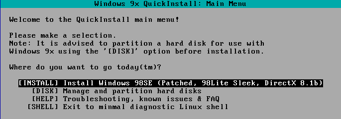

* `INSTALL` - This proceeds with the [installation](#installation)
* `CFDISK` - This leads you to the [Hard Disk Partitioning Tool](#hard-disk-partitioning-tool)
* `SHELL` - This leads you to a [minimalistic Linux shell](#the-emergency-linux-shell).
* `OS` - This button is only visible if you are using an image with two or more installable OS variants.

## Hard Disk Partitioning Tool

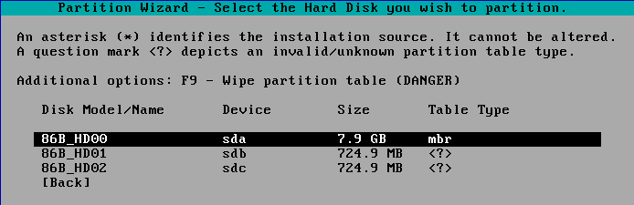

The installer will first lead you to this selection menu. Here you can select the hard disk you wish to partition.


QuickInstall comes with `cfdisk`, a TUI hard disk partitioning tool, to help you set up your hard disk(s) for installation.

The version of `cfdisk` shipped with QuickInstall is *slightly modified* to better fit the purpose of preparing disks for the installation of Windows 9x.

***NOTE: In order to apply the changes, you must click the `[ Write ]` button before exiting the partitioning tool!***

The default for partition creation is `W95 FAT32 (LBA)`.  
However, on very old systems, you may need to choose the non-LBA version instead.

## Installation

### Destination Selection <!-- omit from toc -->

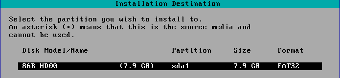

Here you will be asked for the destination partition.

If you are booted off a FAT32-formatted media (e.g. a USB flash drive), it will appear here with an asterisk (`*`), depicting that it cannot be used for installation.

Note: Only partitions/disks marked `mbr` are valid installation destinations.

Partitions with an unsupported file system *cannot be re-formatted* from the installer. You must change the partition type using the partitioning tool.

### Configuration <!-- omit from toc -->

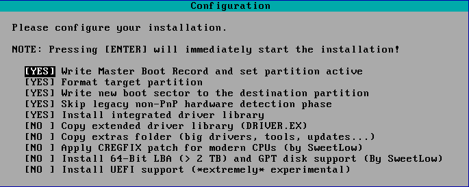

This menu gives you several choices to configure the installation process.  
Sensible defaults are pre-selected, however, you may choose to change them.

For example, you may wish that the partition is not formatted before commencing the installation.  
Or you wish to omit the installation the driver library to speed up the installation process, however, then you will lose the benefits of this library being available to Windows during hardware detection.

The options marked `NO` by default should only be changed when necessary.

Press **Enter** here to start the installation.

### Installation Execution <!-- omit from toc -->

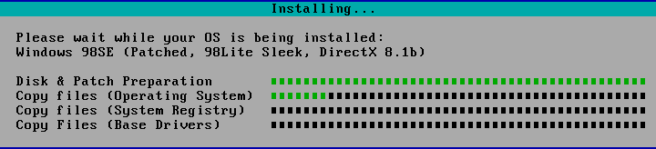

The installation execution dialog will give you continous feedback over the status of the installation. Every major step has its own progress bar.

### Exit Menu <!-- omit from toc -->

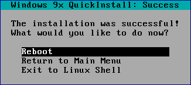

After successful installation, you are presented with the last menu inside the QuickInstall installation environment, which asks you what to do next. The usual choice here is to reboot to finalize the installation.

### Finalization <!-- omit from toc -->

Afterwards, the system should boot into the desired Windows 9x version.

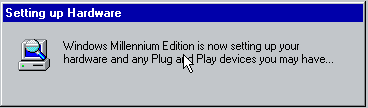

It will then finalize itself by detecting all the hardware in your system, culminating in one final reboot. 

***NOTE: If you experience hangs or errors in this step of the installation, please re-try the installation and set the `Skip legacy non-PnP hardware detection phase` option to `NO` before filing a bug report!***

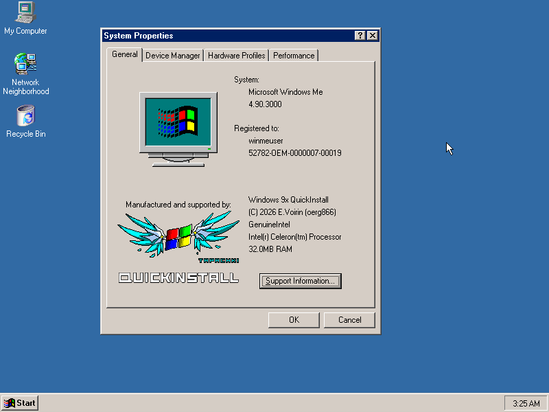

And voilà, you have successfully gone through the QuickInstall experience!


# The Emergency Linux Shell

The QuickInstall environment provides a minimal Linux shell. This allows you to do rudimentary diagonstics.

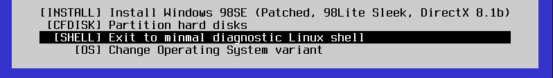

You can `mount` file systems, use `dd` to read and write images, use diagnostic tools such as `lspci`, `lscpu`, etc. and inspect the kernel log using `dmesg|less`, for example.

It will not replace a purpose built and more featured Linux environment, but it may be helpful in a pinch!


## 3dfx Voodoo 2 Diagnostics (`witchery`)

QuickInstall contains the newly released gold-standard tool for diagnosing 3dfx Voodoo 2 cards for your convenience, provided with permission from Fagear.

To use it, type `witchery` at the shell.

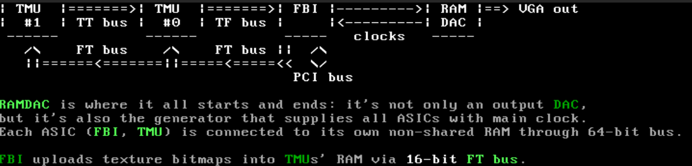

More information here: [Voodoo2 diagnostics software (Witchery)](https://www.vogons.org/viewtopic.php?p=1402129)

# Frequently Asked Questions

## Q: I am getting read or write errors during installation <!-- omit from toc -->

A: Hardware in the 90s and 2000s was eccentric! Especially with regards to faster Multi-Word or Ultra DMA transfer modes on IDE/SATA controllers.

The Floppy, CD/DVD and USB images allow you to boot the kernel with disabled DMA modes, which may help work around the problem!

## Q: Windows freezes when booting after installing from a USB Key <!-- omit from toc -->

A: There is some trouble with USB-Handoff with BIOSes that provide "legacy emulation", i.e. access to USB mass storage via Int13h.

If this problem occurs, please unplug USB mass storage devices when booting. You may plug them again afterwards.

## Q: I'm getting a python error about non-zero return code in `msdos.exe` right after `Using SHELL32.xxx to reboot!` <!-- omit from toc -->

Example:
```
subprocess.CalledProcessError: Command '['L:\\win98-installer\\__BIN__\\tools\\msdos.exe', 'L:\\win98-installer\\__BIN__\\registry\\regedit.exe', '/L:SYSTEM.DAT', '/R:USER.DAT', 'tmp.reg']' returned non-zero exit status 1.
```

A: This problem happens when running the script on Windows whilst the script directory is in a share hosted by a WSL session (Windows Subsystem for Linux). This causes some incompatibilities. Run the script from the WSL Linux shell instead.

## Q: I'm getting I/O and read errors, segmentation faults and other weird behavior when installing from CD on an Intel i430 / i440-based system with an Intel 82371SB south bridge (e.g. i440FX) <!-- omit from toc -->

A: This problem has been verified by Deksor, Rigo and myself, and is a deeply rooted problem that has existed since at least version 2.4.xx. Operating the drives in PIO mode can help.

A BIOS update may help, the issue is currently under investigation as we found some BIOS versions where this problem does not occur.

For now, you can work around this problem by using a PCI SCSI or IDE adapter card that supports CD-ROM boot or has DOS drivers with the **DOS boot floppy option**.

You can also try disabling DMA when booting the CD/Floppy.

## Q: I'm trying to install on a VIA MVP3-based motherboard and I'm getting a "General Protection Fault" on the first boot. (Repoted by Rigo) <!-- omit from toc -->

A: To work around this issue, select the "slow" hardware detection variant in the installation wizard. The problem is currently under investigation.

## Q: I'm trying to install on my 486 and I'm getting Disk I/O errors! <!-- omit from toc -->

A: Your BIOS might have an incomplete/buggy LBA implementation. Partition the drive to use a FAT32 non-LBA partition and try again.

You can also try disabling DMA when booting the CD/Floppy.

## [Framework Building Guide, Bugs, License, etc.](BUILDING.md)

Refer to [BUILDING.md](BUILDING.md)

## Special Thanks

* [TheRetroWeb](http://theretroweb.com) Cool community with cool people
* [SweetLow / LordOfMice](https://github.com/LordOfMice) for his invaluable help by contributing drivers and patch sets
* [Jeff Chen](https://x.com/jeffqchen) for helping to debug boot sector problem
* [Fouquin](https://www.techpowerup.com/contact/) for testing and contributing drivers
* Deksor for being French
* [PhilsComputerLab](http://philscomputerlab.com) for spreading the word
* [goshhhy / linear cannon](https://github.com/goshhhy) for Linux kernel config & systems programming help
* [Rudolph R. Loew](http://lonecrusader.x10host.com/rloew/rloew.html) for a decade of amazing patches and drivers (rest in peace 😢)
* More testing done by: computerguy096, Rigo (0xCats), agent_x007, Enigma, CptKlotz, matcarfer, viti95

---

Long live Windows 9x.  
Oerg866, signing out.
