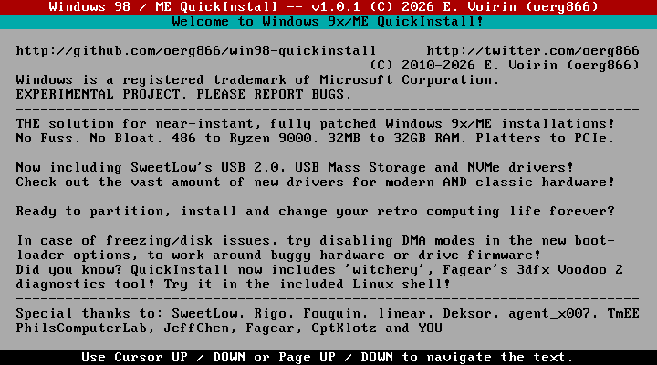
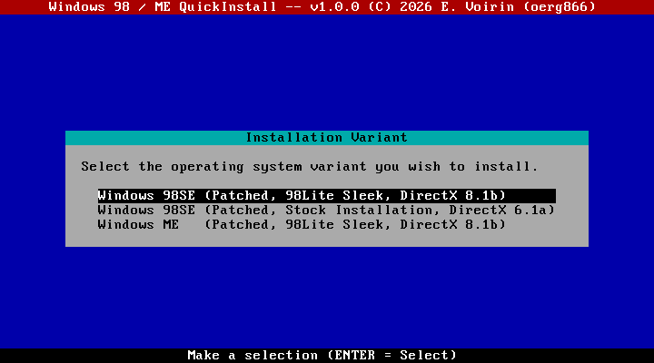
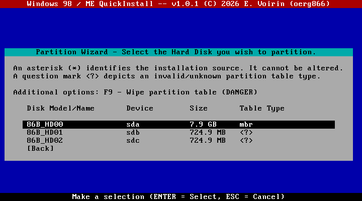
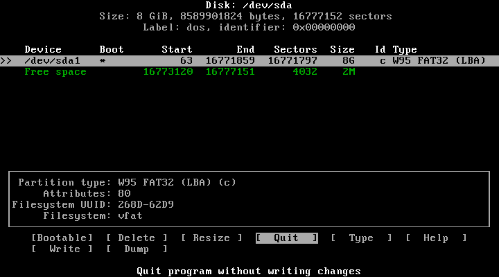
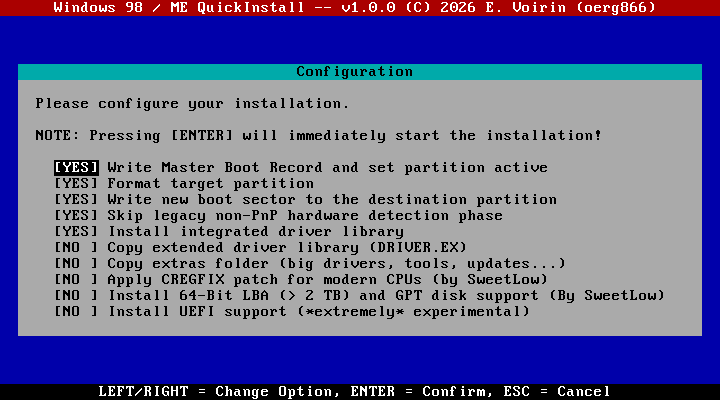
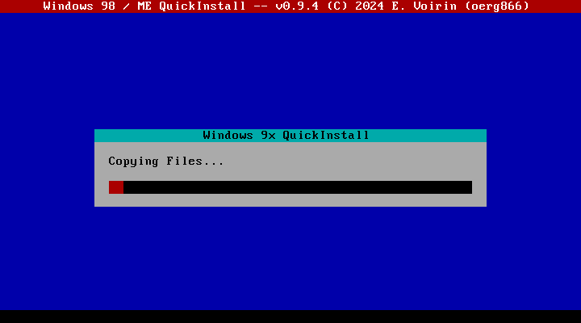
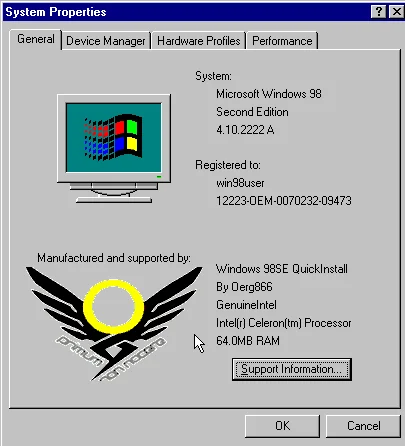
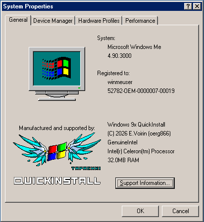

# Windows 9x QuickInstall - (C) 2012 - 2026 E.Voirin (oerg866)

**Windows is a trademark that belongs to Microsoft Corporation.**  
**This project has NO ENDORSEMENT WHATSOEVER from Microsoft Corporation.**  
Please don't sue. I just like old computers :(

## Do you want...

* ...to install Windows 98 or ME *extremely quickly*?
* ...to test a lot of acquired retro-hardware in quick succession?
* ...to install Windows 9x from a USB flash drive or perhaps an SD card?
* ...to install Windows 9x to and boot from an ***NVMe SSD***?
* ...***native AHCI and USB 2.0*** support on Windows 9x?
* ...a fully patched Windows 9x version without manually installing *everything*?
* ...a Windows 9x version that works on modern computers, including non-CSM UEFI machines?
* ...a Windows 9x version optimized for small footprint, maximum functionality and comfort?
* ...said version to also excel on 486-class machines?
* ...a Windows 9x installation with lots of integrated drivers and a lot more available on the install disk?

If you answered *"yes"* to any of the above, you may want to keep reading...

## Screenshots

| | | |
|--------------------------|--------------------------|--------------------------|
|  |  |  |
|  |  |  |
|  |  |                          |

## What is QuickInstall?

Windows 9x QuickInstall is a framework intended to replace the original Windows 9x setup environment and provide an extremely quick and highly optimized and customized installation process paired with integrated patches and drivers. In that sense, it is not dissimilar to *nlite*, but the method used to achieve this is very different.

QuickInstall images are derived from *already set-up and working installations*. This means that they retain any patches, drivers and software that is already installed, enabling more powerful, comfortable, modern and headache-free Windows 9x installations than ever before.

Combining this method with the blooming landscape of third-party patches and fixes, it opens up these classic operating systems to a vast variety of machine classes, ranging from early 486 systems to the very latest Core Ultra and Ryzen machines available on the market today (yes, really).

After preparation, the image is stripped of hardware detection information, and upon installation the Windows 98 Setup's hardware detection phase is re-run, accessing the vast driver library available with QuickInstall.

QuickInstall uses a Linux-based custom installation environment that quickly writes the full installation image to a target directory of your choosing, using a specially-crafted flat binary file format (*MercyPak*) that is designed to be read exactly once, in sequence, to avoid expensive CD drive seeking and attain the maximum installation speed possible.

**This also means you can finally install Windows 9x from USB without any fuss!**  
...or from a CD/DVD-R. Or boot from a floppy disk and *then* install off of USB.

The truth is, it does not matter how you boot the system or where the QuickInstall data is located, if you manage to boot the kernlel, the installation environment will find its files. This also means that you can install Windows from USB on machines that do not support USB-Boot (using the boot floppy)!

And yes, this does mean that the effort for a user to build an ISO is higher than for example nLite, but the degree of customizability is also massively increased.

A set of reference images is also provided for your convenience and to get a feel for the vast power that QuickInstall provides to the retro enthusiast of ~~2023~~ ~~2024~~ ~~2025~~ 2026. Enabling ***you*** to install your favorite flavor of vintage Windows *faster than ever*.

## How "Quick" is QuickInstall *really*?

It depends where!

- In VirtualBox on a modern machine? **15 seconds.**
- On a Pentium III 866MHz with a DVD-ROM and an ATA133 disk? **60 seconds.**
- On a 486 DX4-100? **5 minutes.**

In *any* case, QuickInstall is at least an ***order of magnitude (i.e. 10x)*** faster than the official Windows 98 `setup.exe`

## Reference Images (aka. I don't want to read and/or do all of this.)

The reference images come in three flavors:

- Windows 98 SE: **Stock installation**
- Windows 98 SE: **98Lite Micro De-Bloated installation with DirectX 8.1**
- Wiindows ME: **98Lite Micro De-Bloated installation with DirectX 8.1**

Check the *Releases* tab!

### Reference Image Content:

* Microsoft Patches (QFEs), Windows 98 SE:
  - Q239696, Q239887, Q245682, Q253697, Q253711, Q269601, Q270063, Q273017, Q276602, Q280448, Q281533, Q288430, Q291362, Q293793, Q293197, Q306453, Q381307
* Microsoft Patches (QFEs), Windows ME:
  - Q268452, Q276602, Q278289, Q280800, Q280127, Q290831, Q296773, Q301453, Q301540, Q305826
* Common patches:
  - Microsoft Installer 2.0
  - R. Loew RAM Patch
  - R. Loew SATA Patch
  - R. Loew LBA48 Patch
  - R. Loew non-DOS Partition Corruption Patch
  - DOS disk detection order patch (PCHIO98, Unknown author)
  - SweetLow patches:
    - Patch for RLoew's AHCI.PDR 3.0 - disabled nonfunctional handler of IDE_PASS_THROUGH to prevent BSOD on SMART access
    - Patch for (the latest version of) APIX.VXD (for Windows 98SE) - disabled special handling for devices on Port Driver ESDI_506.PDR
    - Patches for ESDI_506.PDR from Windows 98SE / RLoew's Terabyte Plus Pack 2.1
    - Patches for SMARTVSD.VXD - works for any combination of ATA channels and devices on these channels and more
    - Right .INF for PCI Bus Master ATA Controllers including those in PCI Native Mode with RLoew's "SATA" Patch/Terabyte Package
    - Bug fix VMM.VXD from Windows 98(SE) & ME on handling >4GiB addresses and description of problems with resource manager on newer BIOSes
  - Microsoft Layer for Unicode (unicows)
  - Unofficial 2020 Timezone Update (by PROBLEMCHYLD)
  - Windows 9x TLB invalidation bug patch (Patcher9x by JHRobotics)
  - oerg866 SYSDMCPL HW Detection Speedup Patch
  - oerg866 DOS Mouse Acceleration Fix
  - 7-Zip 9.20 pre-installed

* Extras inside `extras` folder:
  - **Microsoft Updates**: DirectX 9.0C (Aug. 2007), .NET 2.0, IE6 SP1, VB6 / VC6 / VC2005 Runtime, Directory Services Client
  - **KernelEx**:  v4.5.2, v4.5.2016.18 Update, 4.22.26pre2 Update, 4.22.25.2-TMT Cumulative Installer

    **NOTE: This can brick your system, especially on the 98Lite versions this should not be used**
  - Revolutions Pack 9.7 + Updates + Extra Fonts / Themes
  - **Benchmarks**: 3DMark 99 + 2000 + 2001 SE, Super Pi Mod, Roadkill Disk Speed, Atto Disk Benchmark
  - **CPU/Hardware Tools**: CPU-Z Vintage Edition, CPUFSB, HWiNFO32, HDAT2, K6INIT, WPCREDIT, PCIEDIT, Video Memory Tester (VMT / VMTCE)
  - **Utilities**: Total Commander, Paragon NTFS, IrfanView, TCP Optimizer
  - **Drivers**:
    - ALi AGP (1.90, 1.82) + Utility (1.40), ALi Integrated (2.092)
    - AMD: AMD75x/76x Driver Packs (1.30)
    - VIA 4in1 (4.35, 4.43), VIA IDE Driver (3.20B with RLOEW fix), VIA Latency Patch
    - SiS: 5600/600 AGP, SiS 961/964 IDE, SiS 964 RAID, SiS IDE 2.13, UIDE1.02, AGP/USB/ATA133 1.21
    - Intel: INF Installer (6.3.0.1007)
    - nVidia: GeForce (45.23, 81.98), nForce (4.20)


## Building the Framework, Bugs, License, etc.

See [BUILDING.md](./BUILDING.md).

# Supported Target Operating Systems

* Microsoft Windows **98** (Build 4.10.1998) -- *UNTESTED* 
* Microsoft Windows **98 Second Edition** (Build 4.10.2222)
* Microsoft Windows **Millenium Edition** (Build 4.90.3000)

Support for international versions is not properly tested. It should work and in my testing it does, but YMMV. Please report bugs!

**NO versions of Windows 95 are supported due to non-PNP device detection being part of the DOS-based installer stage.**

# QuickInstall System Requirements for Installation
  - i486-class CPU, at least a 486SX (but it will be very slow)
  - 24 MiB of memory
  - An IDE / SATA / SCSI / NVMe controller supported by Linux

# Booting QuickInstall

There are several provided methods to boot into Windows 98 QuickInstall:

## Native Floppy Disk Boot (`floppy.img`)

  This is a 1.44M floppy disk image that contains a full kernel with USB support.  
  It will find its installation source media automatically, meaning you can use it together with a QuickInstall CD/DVD-ROM, USB flash drive (even if your system does not support booting from either of them), CF-Card or Hard Disk.

  **Note:** Due to the strong compression used in this version, the system will take a long time to start up on 486SX/DX-class machines. I recommend using `dosflop.img` instead.

  **Note:** Due to the size constraints, this version does not print diagnostic messages on the screen when starting up.

## Floppy Disk DOS + CD-ROM boot (`dosflop.img`)

  This is a 1.44M floppy disk image with FreeDOS and a CD-ROM driver that loads and boots QuickInstall directly off of a CD-ROM or hard disk drive (using `LOADLIN`).  
  **Recommended** if you have a computer that does not support CD-ROM boot.

  *Also recommended if you have the QuickInstall files on an ATA/ATAPI media or other device that is exposed using Int 13h*

  **Note:** If you have a SCSI CD-ROM drive, the image must be modified accordingly.

## CD / DVD-ROM Boot

  The `iso` images can be written to a CD or DVD and then booted. **This is the recommended method on systems that support this.**
  
  Since this uses the classic *floppy emulation* boot method it should work very well even on the earliest BIOSes that provide CD-ROM boot support.

## USB Flash Drive / SD Card / CF Card boot

  By using a tool such as *Win32 Disk Imager* on Windows, or `dd` on Linux / BSD, you can write the `usb` images to a flash drive and boot off of it.

  You can also use the *Native Floppy Disk Boot* method to execute QuickInstall off a flash drive if your PC does not support booting from such media.

## UEFI Boot (Caution: experimental!)

  Executing the steps for *USB Flash Drive Boot* described above, the resulting media can also be booted on UEFI systems, even those that lack the Compatibility Support Module (CSM).

  **Note:** UEFI installation support is *very* experimental at this point in time, and no support can be provided if it fails.

### Hard Disk / CF-Card / SD-Card Boot

  It is not recommended, but you can also write the "usb" image to a hard disk drive.  
  As long as your system supports booting from it, it will work and install normally.

# System Requirements to **create** QuickInstall Images from Scratch

- A Hard Disk image (IMG/RAW, VHD, VMDK, VDI) containing a fully set up Windows 9x installation according to the guidelines described in the chapter ***Preparing a Windows 98 / ME image for use with `sysprep.py`***

- **Windows 10 or 11** (7 / 8.x may also be supported, but are untested)
  or **Linux**  (Tested with Ubuntu 22.04)
  or **WSL**  (Tested with Ubuntu 22.04)

- `python` (3.8 or newer, 3.11 recommended)

  * **Windows 7 and 8.1**: Download a python installation package from https://www.python.org/downloads/
  * **Windows 10 and 11**: Use the Microsoft Store to download an appropriate version
  * On **Linux (Debian, Ubuntu)**: `sudo apt install python3`

- **Python Requirements**

  Run the following command in the framework directory:

  `pip3 install -r requirements.txt`

  ***WARNING:*** *There are no third-party tools to modify Windows 9x-format registry DAT files, but doing so is an essential part of the image building process. This uses an MS-DOS emulation layer and the 16-Bit part of the Windows 9x registry editor (`regedit.exe`). This means that currently, on platforms other than Windows, `wine` is needed to be installed:*

  - `sudo apt install wine` (Debian, Ubuntu, ...)
  - `sudo pacman -S wine` (Arch, ...)

  To enable 32-bit Wine to run correctly, multiarch needs to be enabled first:
  - `sudo dpkg --add-architecture i386 && apt-get update`

# Preparing a Windows 9x Image to create a QuickInstall Image from Scratch

- Install Windows 98 / ME in a virtual machine or emulator, just as you want it.
  I recommend using *86Box* or *PCBox* using the following configuration:

  - **Machine:** Slot 1, [i440BX] Abit BF6, Intel Pentium II, 64MB RAM
  - **Display:** [ISA] VGA (or any video card that does not have an integrated driver in Windows 98 / ME)
  - **Network:** NONE - ***VERY IMPORTANT TO MAKE SURE NETWORK DRIVER SETUP STAYS INTACT!!***
  - **Hard disks:** IDE (0:0), big enough to install the operating system.

  It is recommended that you install Windows in APM mode, because ACPI is a buggy mess (`setup /p i`).

  **NOTE:** The operating system ***must*** be installed from the HARD DISK and it must contain ***exactly one*** folder containing the Windows 98 CAB files from the CDROM. Only *one* Windows directory is allowed, and only *one* Windows setup files CAB directory. If you install using 98Lite, make sure that the 98Lite setup directory is the sole carrier of these CABs.

  **NOTE:** It is recommended that NO extra drivers are *installed* in this VM. They can be added using the `--driver` parameter

  **Note:** It is not recommended to use a modern hypervisor such as Hyper-V, VirtualBox or VMWare to perform these steps, as an unpatched Windows 98 installation is highly unstable on modern CPUs (even under virtualization), making the installation steps before these bugs are patched very hard to execute.

- Configure the Windows 98 / ME installation as you wish:

  - System parameters (Computer Name, User Name, System / Explorer Options, Theme, etc.)
  - System patches (Official updates, third-party patches, etc.)
  - Utilities (Software, Benchmarks, Utilities, etc.)

- Shut down the virtual machine and take note of the hard disk image file name.

# The `sysprep.py` Script to create QuickInstall Images

  This script serves the purpose of preparing an installation for packaging into an ISO and/or USB image file.

  It takes the following parameters:

  * `--iso <ISO>`  
    Instructs the script to create an ISO image with the given file name
  
  * `--usb <USB>`  
    Instructs the script to create an USB key image with the given file name
  
  * `--osroot <Image File> "Display Name"`  
    Specifies a Windows 98 / ME hard disk image as the source.
    
    `Image File` can be any of the following file formats: IMG/RAW, VHD, VMDK, VDI. It can be dynamically sized or a differential image (e.g. from a hypervisor snapshot)

    `Display Name` is the name this image will have in the Installer selection (if you build an output image with more than one OS on it)

    **This can be specified multiple times, in which case the installation wizard will show a selection menu.**

  * `--extra <EXTRA>`  
    Instructs the script to add the files in this directory to the final ISO/USB output.

    Default: `_EXTRA_CD_FILES_` in the framework directory

    **This can be specified multiple times, all the files in all the directories will be added in this case**

    The data will be put into the `extra` folder in the output image

  * `--drivers <DRIVERS>`  
    Instructs the script to process and *slipstream* all drivers in this directory.

    *Slipstream* means that these drivers will be installed automatically when the hardware for them is detected at any point of the installation's lifetime, even when the hardware is not yet present at the time of installation.

    Default: `_DRIVER_` in the framework directory. It already contains a curated selection of drivers (from the `win98-driver-lib-base` repository)

    **This parameter can only be specified once.**

  * `--extradrivers <EXTRADRIVERS>`  
    Instructs the script to process all drivers in this directory and add them into the extra drivers directory.

    **These drivers are NOT slipstreamed** and thus not automatically installed. They are however made available on the resulting installation media and can be installed by pointing the Windows 98 / ME `Add New Hardware` wizard to the `DRIVER.EX` directory on the output image.

    The reason for this folder's existence is the vast selection of hardware available for the operating systems and the varying compatibility / size of them.
    
    Very large drivers are recommended to go in here, as well as drivers for which it cannot be assumed that different versions have different compatibility and speed.

    For example, it is better to choose an older driver for an older *nVidia GeForce* card even though a newer one would also support this hardware for speed reasons, whilst the newer driver should also be available, in case newer hardware is present.

    Default: `_EXTRA_DRIVER_` in the framework directory. It already contains a curated selection of drivers.

    **This parameter can only be specified once.**

  * `--verbose VERBOSE`  
  This parameter controls console output verbosity of the script. `VERBOSE` is either `True` or `False` (default).  
  **This parameter is currently broken, sorry. It's always quiet.**

# Steps for preparing & packaging a QuickInstall Image after VM Creation

- Copy drivers that you want slipstreamed into a directory of your choice. By default this is `_DRIVER_` in the framework directory directory.

  *NOTE: `_DRIVER_` is already filled with a curated selection of drivers. You can remove these, if you wish.*

  **If you choose a non-default directory for this, you must specify it using the `--drivers` parameter.**

- Copy extra drivers that will not be slipstreamed but added to a directory of your choice. By default this is `_EXTRA_DRIVER_` in the framework directory.

  *NOTE: These drivers will be processed in the same way as the slipstreamed ones but will not be copied to the hard drive during installation.*

  *INFO: This folder will be named `DRIVER.EX` on the resulting image.  
  You can point the Windows 98 hardware wizard to this folder and the drivers will be found and installed correctly.*

  *NOTE: `_EXTRA_DRIVER_` is already filled with a curated selection of drivers. Ycan remove these, if you wish.*

  **If you choose a non-default directory for this, you must specify it using the `--extradrivers` parameter.**

- Add any extra files you wish added to the ISO to a directory of your choice. By default this is `_EXTRA_CD_FILES` in the framework directory.

  This can include drivers that you do not wish to be processed with the QuickInstall tools, e.g. drivers that contain bundled software.

  **If you choose a non-default directory for this, you must specify it using the `--extra` parameter.**

- Run the following command to build the package:

  `sysprep.py --osroot <Windows 98 Image File> "Human-Readable Name For The Image" --iso <Output ISO File Name>`  
  Or if you prefer to create a USB key image instead:  
  `sysprep.py --osroot <Windows 98 Image File> "Human-Readable Name For The Image" --usb <Output USB File Name>`
  
  You can absolutely create both a ISO and USB image at the same time. Here is an example:

  `sysprep.py --osroot myImage.vhd "Windows 98 SE" --iso win98qi.iso --usb win98qi.img`

  NOTE: *You must add the other parameters if you deviate from the defaults.*

## How to write the bootable USB image to a USB flash drive

- On Linux, you can use `dd`
  - `dd if=<USB image file> of=/dev/sdX bs=1024k status=progress`
    
    Replace `/dev/sdX` with the USB flash drive's device path.

- On Windows, you can use the following tools:
  - `dd` For Windows: http://www.chrysocome.net/dd
  - `Win32 DiskImager`: https://sourceforge.net/projects/win32diskimager/

## Packaging multiple Windows 9x Versions in one QuickInstall Image

This is an advanced feature.

By specifying the `--osroot` parameter multiple times, you can create a multi-variant installation image. In this case a selection menu will appear during installation prompting the user which variant should be installed.

Example:

`python3 sysprep.py --osroot D:\QI\Stock.VHD "98SE Stock" --osroot D:\QI\Micro.VHD "98SE Micro" --iso multi.iso`

## Fixes, Patches and Drivers provided by the QuickInstall Environment

These patches and fixes do not need to be integrated into the Windows image before creating a QuickInstall image.

* **CREGFIX**  
  This is a patch for CREGFIX an issue of many modern CSM BIOS implementations where certain control register bits are left dirty, causing issues when trying to run Windows 9x ("*While initializing device VCACHE: Windows protection error*") or while trying to run EMM386.EXE.

  **This universal VxD fix version was provided by SweetLow / LordOfMice :)**

* **Silent Default Display Prompt**  
  This gets rid of the "Default Monitor" install dialog that normally pops up.

* **UEFI boot files (CSMWRAP)**  
  This is a EFI binary that provides BIOS emulation functions on EFI-only systems without CSM, allowing you to boot Windows 9x on them.

  Courtesy of: https://github.com/FlyGoat/CSMWrap

And not to forget, the ***vast driver libraries***:

* `win98-driver-lib-base`

  These drivers will be processed and packaged alongside the OS data. If selected during installation, these drivers are integrated into windows and will be found during any hardware detection.

  This includes many network drivers, common sound and video card drivers, storage drivers, etc.

  This includes the excellent USB 2.0, USB Mass Storage and NVMe driver stacks from **SweetLow / LordOfMice**.  
  It also includes his patched versions of the R.Loew native AHCI SATA drivers.

* `win98-driver-lib-extra`

  These drivers will be processed and packaged in a subdirectory of the installation media, but they are not injected into Windows' automatic hardware detection. This can have several reasons:
  - The driver is very big
  - The driver is part of a hardware family where no single driver is guaranteed to be optimal
  - The driver is for a chip, but may lack card vendor-specific functionality
  - The driver is known to cause problems


More may come soon!

# Frequently Asked Questions

## Q: I am getting read or write errors during installation

A: Hardware in the 90s and 2000s was eccentric! Especially with regards to faster Multi-Word or Ultra DMA transfer modes on IDE/SATA controllers.

The Floppy, CD/DVD and USB images allow you to boot the kernel with disabled DMA modes, which may help work around the problem!

## Q: Windows freezes when booting after installing from a USB Key

A: There is some trouble with USB-Handoff with BIOSes that provide "legacy emulation", i.e. access to USB mass storage via Int13h.

If this problem occurs, please unplug USB mass storage devices when booting. You may plug them again afterwards.

## Q: I'm getting a python error about non-zero return code in `msdos.exe` right after `Using SHELL32.xxx to reboot!`

Example:
```
subprocess.CalledProcessError: Command '['L:\\win98-installer\\__BIN__\\tools\\msdos.exe', 'L:\\win98-installer\\__BIN__\\registry\\regedit.exe', '/L:SYSTEM.DAT', '/R:USER.DAT', 'tmp.reg']' returned non-zero exit status 1.
```

A: This problem happens when running the script on Windows whilst the script directory is in a share hosted by a WSL session (Windows Subsystem for Linux). This causes some incompatibilities. Run the script from the WSL Linux shell instead.

## Q: I'm getting I/O and read errors, segmentation faults and other weird behavior when installing from CD on an Intel i430 / i440-based system with an Intel 82371SB south bridge (e.g. i440FX)

A: This problem has been verified by Deksor, Rigo and myself, and is a deeply rooted problem that has existed since at least version 2.4.xx. Operating the drives in PIO mode can help.

A BIOS update may help, the issue is currently under investigation as we found some BIOS versions where this problem does not occur.

For now, you can work around this problem by using a PCI SCSI or IDE adapter card that supports CD-ROM boot or has DOS drivers with the **DOS boot floppy option**.

You can also try disabling DMA when booting the CD/Floppy.

## Q: I'm trying to install on a VIA MVP3-based motherboard and I'm getting a "General Protection Fault" on the first boot. (Repoted by Rigo)

A: To work around this issue, select the "slow" hardware detection variant in the installation wizard. The problem is currently under investigation.

## Q: I'm trying to install on my 486 and I'm getting Disk I/O errors!

A: Your BIOS might have an incomplete/buggy LBA implementation. Partition the drive to use a FAT32 non-LBA partition and try again.

You can also try disabling DMA when booting the CD/Floppy.

---

Long live Windows 9x.  
Oerg866, signing out.
